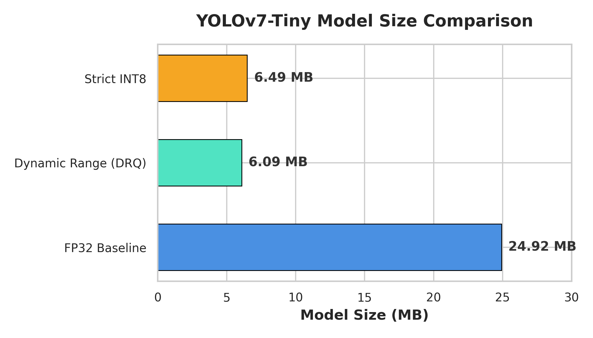
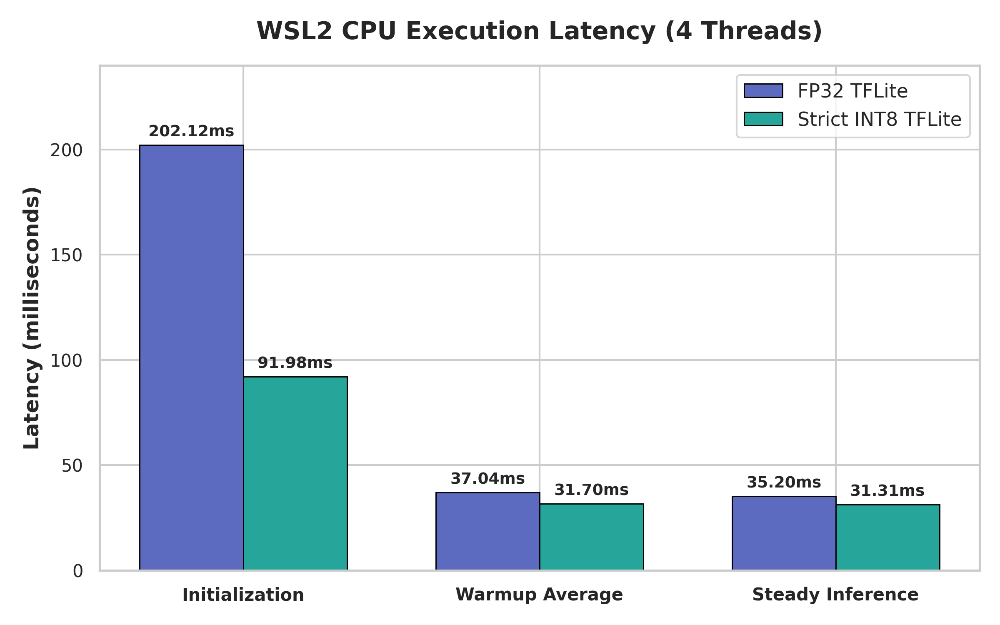
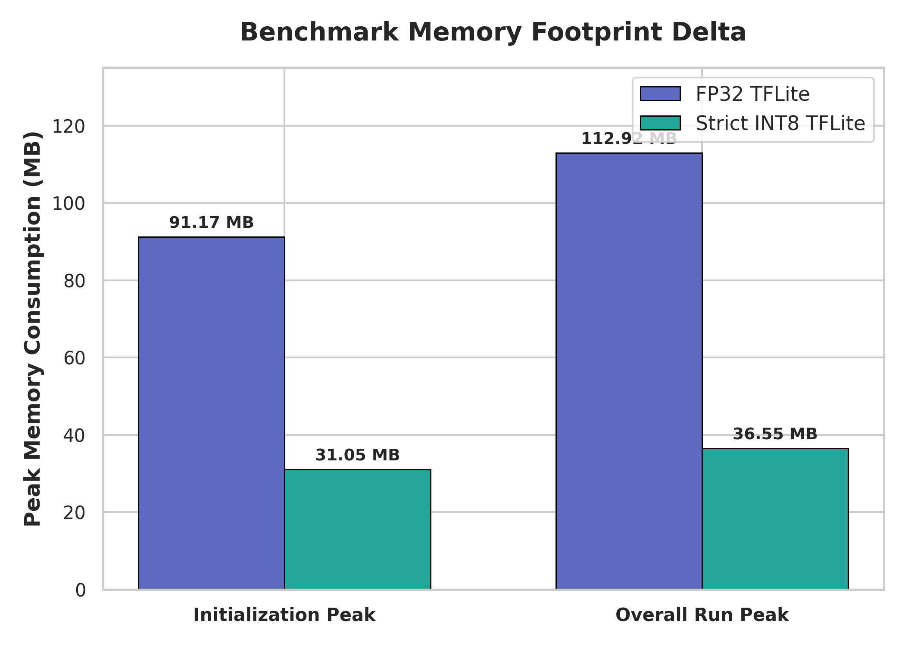
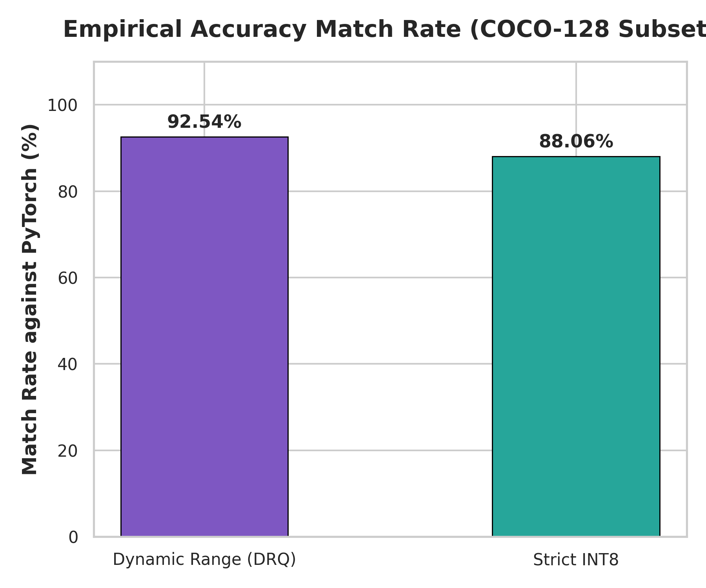

# YOLOv7-Tiny: 8-Bit Integer Quantization & Edge Optimization

This repository is a forked implementation of [WongKinYiu/yolov7](https://github.com/WongKinYiu/yolov7), specifically customized to optimize, quantize, and deploy the **YOLOv7-Tiny** object detection model on resource-constrained edge CPU and TPU hardware.

The original codebase was extended with a fully decoupled **Edge Optimization Suite** located in the [edge_optimization/](edge_optimization/) subfolder, covering calibration, quantization, lightweight C++ profiling, manual grid decoding, and comparative validation pipelines.

---

## Key Performance Highlights
By compiling the baseline PyTorch model to a strictly integer quantized (`int8`) TensorFlow Lite format and running on 4 CPU threads, we achieved:
* **Model Size**: Reduced by **73.9%** (from **24.92 MB** to **6.49 MB**).
* **Initialization Speed**: Increased by **2.2x** (from **202.12 ms** to **91.98 ms**).
* **Peak Memory Footprint**: Decreased by **3.1x** (from **112.92 MB** to **36.55 MB**).
* **Steady-State Latency**: Achieved an **11.1% inference speedup** (from **35.20 ms** to **31.31 ms**).
* **Accuracy Preservation**: Maintained an **88.06% match rate** compared to the original PyTorch FP32 model with only a **4.4%** average confidence score deviation.

---

## Folder Structure
All custom optimization files reside inside the `edge_optimization/` subfolder:
```
yolov7/edge_optimization/
├── download_coco128.py        # Curation of calibration images
├── calibration_generator.py   # Standalone NCHW/NHWC representative data generator
├── convert_tflite.py          # DRQ and INT8 TFLite compilation
├── validate_quantization.py   # Stability and non-zero tensor verification
├── finalize_int8.py           # Production strict INT8 compiler (enforcing int8 inputs/outputs)
├── download_benchmark.py      # Automated retrieval of TFLite C++ benchmark binary
├── edge_inference.py          # Lightweight runtime execution using tflite-runtime
├── edge_inference_nms.py      # End-to-end edge run: manual grid decoding + NMS + Overlays
├── pytorch_inference.py       # Baseline inference on COCO subset (generating ground truths)
├── evaluate_accuracy.py       # IoU-greedy accuracy evaluation suite (matching PyTorch)
└── generate_charts.py         # Automated comparison chart plotter
```

---

## Solving the Quantization Collapse
Standard full-integer quantization of YOLOv7 often suffers from **quantization collapse**, where the model outputs all-zero scores.

### The Root Cause
A typical YOLOv7 export concatenates absolute coordinates (`[0.0, 640.0]`) with probability scores (`[0.0, 1.0]`) into a single output tensor `(1, 25200, 85)`. Full integer quantization computes a single scale step for this entire tensor. Because the scale is dominated by coordinate magnitude, it is set to a coarse value of **`2.749`**. Since the step size is larger than 1.0, all probability scores round down to exactly `-128` (representing `0.0` dequantized), causing the model to detect nothing.

### The Resolution
We re-exported the model **without grid decoding layers**. This yields three raw head tensors corresponding to strides 8, 16, and 32 (shapes `1x3x80x80x85`, `1x3x40x40x85`, and `1x3x20x20x85`). 

Because coordinates are represented as small grid offsets (`[-2.0, 2.0]`) rather than absolute pixels, they occupy the same range as classification logits. TFLite computed fine-grained per-tensor scales (**`~0.18`**), maintaining high precision and eliminating the collapse. Grid decoding was shifted to Python.

---

## Visualized Comparison

### Model Size Comparison


### Execution Latency (4 CPU Threads)


### Peak Memory Consumption


### Empirical Accuracy Match Rate


## Environment Setup

The optimization workflow utilizes containerized Linux environments running under WSL2 to ensure reproducibility.

### 1. Install Docker Desktop
Download and install [Docker Desktop for Windows](https://www.docker.com/products/docker-desktop/). Ensure that the **WSL2-based engine** is enabled in the Docker settings under **General**.

### 2. Configure WSL2 Resource Allocation
To prevent Docker containers from consuming all host RAM and CPU capacity, configure resource limits:
1. Navigate to your Windows user profile folder (e.g., `C:\Users\<YourUsername>`).
2. Create or edit a file named `.wslconfig` and add the following parameters:
   ```ini
   [wsl2]
   memory=16GB
   processors=8
   ```
3. Restart WSL by running `wsl --shutdown` in PowerShell, then restart Docker Desktop.

### 3. Pull Base Images
Pull the pre-configured base images from NVIDIA and TensorFlow registries:
```powershell
# PyTorch Container
docker pull nvcr.io/nvidia/pytorch:23.08-py3

# TensorFlow Container
docker pull tensorflow/tensorflow:latest
```

---

## Reproducible Step-by-Step Guide

All steps are designed to run inside clean Docker containers using standard workspace mount arguments.

### Step 1: Export ONNX Model without Grid
Run inside the PyTorch container to translate PyTorch weights to ONNX:
```powershell
docker run --rm -v C:\Users\Usuario\Desktop\PORTFOLIO\YOLO:/workspace -w /workspace/yolov7 nvcr.io/nvidia/pytorch:23.08-py3 bash -c "pip install seaborn onnxsim && python export.py --weights yolov7-tiny.pt --simplify --device cpu"
```

### Step 2: Convert ONNX to NHWC SavedModel
Run inside the TensorFlow container to execute conversion and layout alignment:
```powershell
docker run --rm -v C:\Users\Usuario\Desktop\PORTFOLIO\YOLO:/workspace -w /workspace/yolov7/edge_optimization tensorflow/tensorflow:latest python run_onnx2tf.py
```

### Step 3: Curate Calibration Dataset
Retrieve COCO-128 and generate the representative calibration datasets:
```powershell
docker run --rm -v C:\Users\Usuario\Desktop\PORTFOLIO\YOLO:/workspace -w /workspace/yolov7/edge_optimization tensorflow/tensorflow:latest python download_coco128.py
```

### Step 4: Full Integer Quantization
Quantize the SavedModel and enforce strictly `int8` data types on all inputs and outputs:
```powershell
docker run --rm -v C:\Users\Usuario\Desktop\PORTFOLIO\YOLO:/workspace -w /workspace/yolov7/edge_optimization tensorflow/tensorflow:latest bash -c "pip install opencv-python-headless && python convert_tflite.py && python finalize_int8.py"
```

### Step 5: Execute Profile Benchmark
Measure latency and memory footprint using the C++ benchmark model utility:
```powershell
docker run --rm -v C:\Users\Usuario\Desktop\PORTFOLIO\YOLO:/workspace -w /workspace/yolov7/edge_optimization tensorflow/tensorflow:latest bash -c "python download_benchmark.py && ./benchmark_model --graph=yolov7-tiny_saved_model/yolov7-tiny_float32.tflite --num_threads=4 && ./benchmark_model --graph=yolov7_tiny_int8.tflite --num_threads=4"
```

### Step 6: End-to-End Edge Inference with NMS
Execute Python edge inference using manual input quantization, grid decoding, and non-maximum suppression overlays:
```powershell
docker run --rm -v C:\Users\Usuario\Desktop\PORTFOLIO\YOLO:/workspace -w /workspace/yolov7/edge_optimization tensorflow/tensorflow:latest bash -c "pip install opencv-python-headless && python edge_inference_nms.py"
```

### Step 7: Run Comparative Accuracy Evaluation
Generate baseline PyTorch ground truths and verify the match rate:
```powershell
# 1. Run PyTorch baseline
docker run --rm -v C:\Users\Usuario\Desktop\PORTFOLIO\YOLO:/workspace -w /workspace/yolov7/edge_optimization nvcr.io/nvidia/pytorch:23.08-py3 bash -c "pip install seaborn && python pytorch_inference.py"

# 2. Run TFLite comparative suite
docker run --rm -v C:\Users\Usuario\Desktop\PORTFOLIO\YOLO:/workspace -w /workspace/yolov7/edge_optimization tensorflow/tensorflow:latest bash -c "pip install opencv-python-headless && python evaluate_accuracy.py"
```

---

## Original Repository Reference
The core YOLOv7 architecture and network configuration files belong to the original authors:
* **Paper**: [YOLOv7: Trainable bag-of-freebies sets new state-of-the-art for real-time object detectors](https://arxiv.org/abs/2207.02696)
* **Original Repository**: [WongKinYiu/yolov7](https://github.com/WongKinYiu/yolov7)
